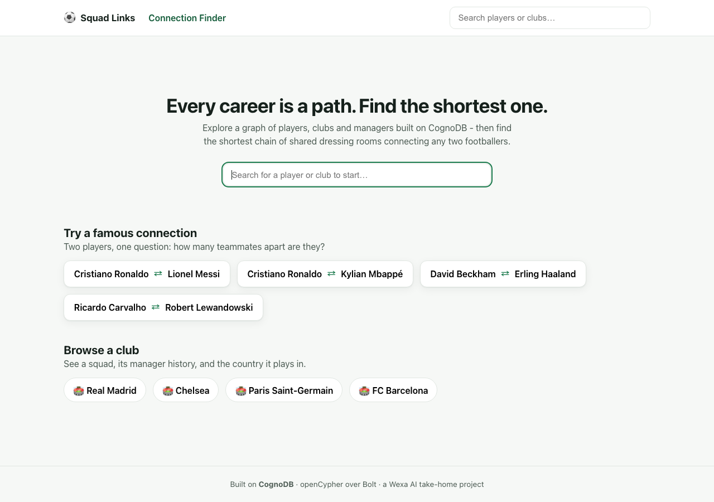
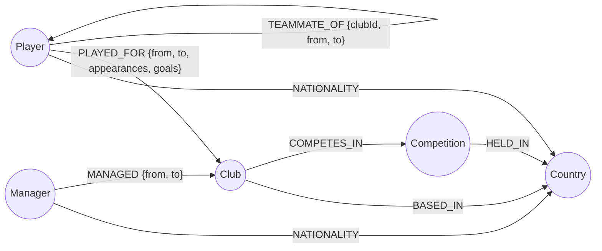
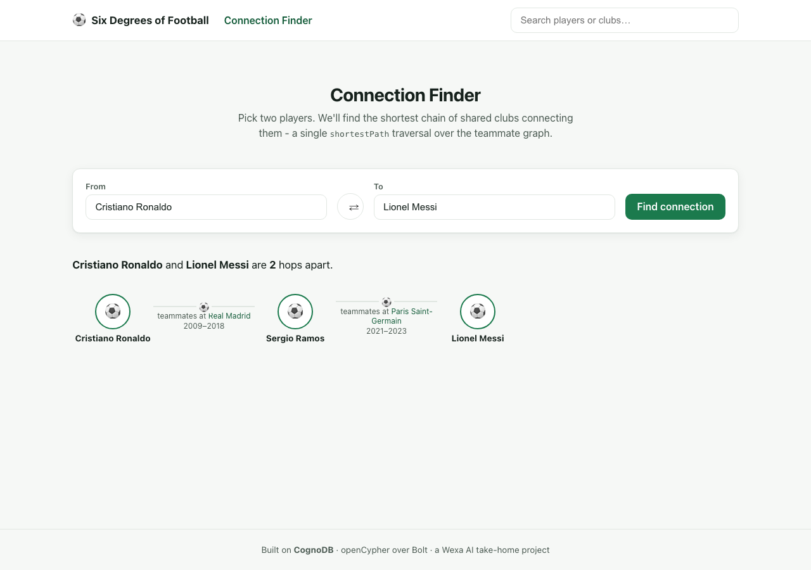
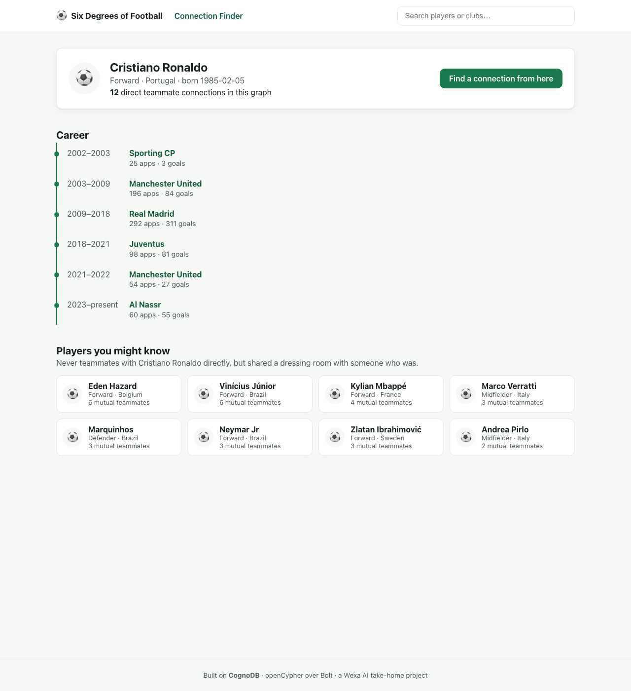
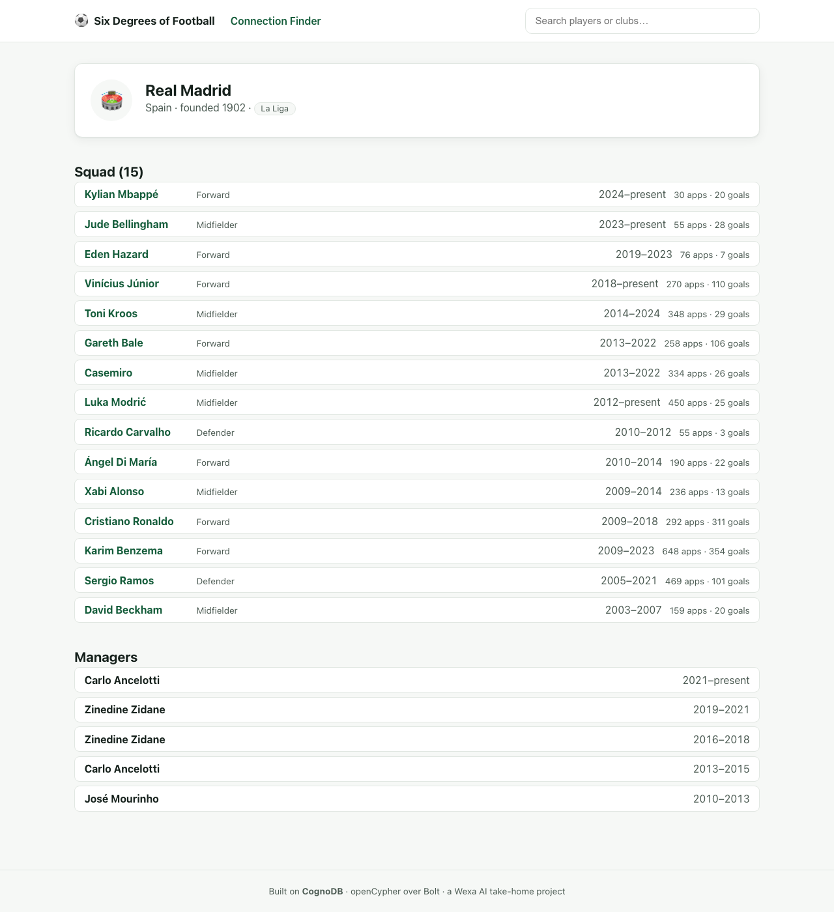
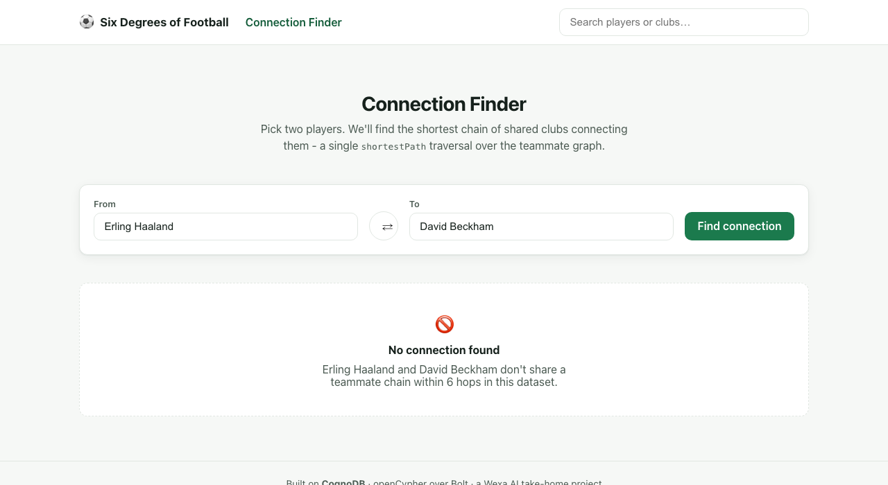

# Squad Links

[](LICENSE)

A graph-database app for exploring footballers, clubs and managers — and for answering the
question every football argument eventually needs: **how many teammates apart are two players?**

Built for the Wexa AI take-home assignment, on **CognoDB** (openCypher over Bolt) as the data layer.

- 🏠 **Home** — search, and a few pre-picked "famous connections" to try immediately
- 👤 **Player profile** — full career timeline, "players you might know" (2-hop teammate suggestions), and any manager reunions
- 🏟 **Club profile** — squad history and manager history
- 🔗 **Connection Finder** — the flagship feature: shortest path of shared-club teammates between any two players



---

## Why a graph database?

Football careers are naturally a graph: players move between clubs, clubs employ managers,
managers move between clubs too, and every overlap in time at the same club creates a
*relationship* between two people. The questions worth asking about this data are almost all
about **paths and connections**, not aggregates:

- *"How is Cristiano Ronaldo connected to Lionel Messi through shared teammates?"*
- *"Which players followed a manager from one club to the next?"*
- *"Who's one step removed from this player's teammate circle, but never played with them directly?"*

In a relational schema, the first two questions require a **recursive CTE** with manual cycle
detection, and the query gets more expensive with every hop you add — there's no way to stop as
soon as a shortest path is found, and "up to 6 hops in either direction" turns into a genuinely
painful self-join chain. In Cypher, it's:

```cypher
MATCH path = shortestPath((a:Player {id:$fromId})-[:TEAMMATE_OF*1..6]-(b:Player {id:$toId}))
```

One line, and the database's traversal engine — not application code — does the pathfinding,
stopping the instant it finds the shortest route. That's the core argument for a graph database
here: **the interesting operations are traversals, and a graph database makes traversal the
native, indexable, boundedly-fast operation instead of an emulated one.**

---

## Data model



| Node | Key properties |
|---|---|
| `Player` | `id`, `name`, `dob`, `position` |
| `Club` | `id`, `name`, `founded` |
| `Manager` | `id`, `name` |
| `Competition` | `id`, `name`, `tier` |
| `Country` | `id`, `name` |

| Relationship | From → To | Properties | Notes |
|---|---|---|---|
| `PLAYED_FOR` | Player → Club | `from`, `to`, `appearances`, `goals` | One per career spell; `to` is `null` if ongoing |
| `MANAGED` | Manager → Club | `from`, `to` | One per managerial spell |
| `TEAMMATE_OF` | Player → Player | `clubId`, `from`, `to` | **Derived**, not raw input — see below |
| `COMPETES_IN` | Club → Competition | — | |
| `BASED_IN` | Club → Country | — | |
| `HELD_IN` | Competition → Country | — | |
| `NATIONALITY` | Player/Manager → Country | — | |

**`TEAMMATE_OF` is a derived relationship.** The seed script (`server/src/seed/computeTeammates.js`)
scans every pair of `PLAYED_FOR` spells at the same club and, wherever two players' date ranges
overlap, writes a `TEAMMATE_OF` edge carrying the club and the overlapping window. This is a
one-time bulk derivation done in JS at load time — once written, it turns "find the shortest chain
of shared dressing rooms" from a runtime date-overlap join into a plain, indexable graph
traversal. Precomputing it is itself a graph-modeling decision: it trades a bit of load-time
computation for queries that stay fast and simple no matter how deep the traversal goes.

---

## The main queries

All queries are parameterised through the official `neo4j-driver` — no string-concatenated Cypher
anywhere in the codebase (see `server/src/queries/*.js`).

### 1. Connection Finder — multi-hop shortest path (flagship query)

```cypher
MATCH (a:Player {id: $fromId}), (b:Player {id: $toId})
OPTIONAL MATCH path = shortestPath((a)-[:TEAMMATE_OF*1..6]-(b))
RETURN a, b, path
```

Variable-length shortest-path search between two arbitrary players, up to 6 hops. This is the
query a relational database would find genuinely awkward — no recursive-CTE contortion, no
cycle-detection bookkeeping, and CognoDB's planner stops as soon as the shortest path is located
instead of exploring every path up to the hop limit.

**Example:** Cristiano Ronaldo → Lionel Messi resolves in 2 hops, via Sergio Ramos (Real Madrid
2009–2018, then PSG 2021–2023 alongside Messi):



### 2. "Followed the manager" — a 4-hop pattern with overlapping date ranges

```cypher
MATCH (p:Player {id: $id})-[s1:PLAYED_FOR]->(c1:Club)<-[m1:MANAGED]-(mgr:Manager)
                              -[m2:MANAGED]->(c2:Club)<-[s2:PLAYED_FOR]-(p)
WHERE c1 <> c2
  AND m1.from < m2.from
  AND s1.from <= coalesce(m1.to, date()) AND coalesce(s1.to, date()) >= m1.from
  AND s2.from <= coalesce(m2.to, date()) AND coalesce(s2.to, date()) >= m2.from
RETURN DISTINCT mgr, c1, c2, m1.from AS firstFrom, m2.from AS secondFrom
```

Finds players who played under the same manager at two different clubs, with each spell's dates
actually overlapping the manager's tenure there. In SQL this is a self-join across two
relationship tables with four independent date-range conditions — here it's one graph pattern.
The dataset's real example: **Ricardo Carvalho** played under **José Mourinho** at Porto, then
followed him to Chelsea, then again to Real Madrid.

### 3. "Players you might know" — 2-hop traversal with an anti-join

```cypher
MATCH (a:Player {id: $id})-[:TEAMMATE_OF]-(direct:Player)
WITH a, collect(DISTINCT direct.id) AS directIds
MATCH (a)-[:TEAMMATE_OF]-(mutual:Player)-[:TEAMMATE_OF]-(fof:Player)
WHERE fof.id <> a.id AND NOT fof.id IN directIds
RETURN fof, count(DISTINCT mutual) AS mutualTeammates
ORDER BY mutualTeammates DESC
```

A classic "friend of a friend, but not already a friend" traversal: players who share a teammate
with the given player but never played alongside them directly, ranked by how many mutual
teammates they share. Equivalent to a self-join plus a `NOT IN` subquery over a many-to-many table
in SQL.

> **An honest engineering note:** the more idiomatic Cypher form of this anti-join —
> `WHERE NOT (a)-[:TEAMMATE_OF]-(fof)` as a pattern predicate — mis-resolves `fof` on this CognoDB
> instance when both endpoints of the negated pattern are already bound from an earlier multi-hop
> `MATCH` (confirmed by isolating it with the driver directly: it silently collapses `fof` back to
> `a`'s direct neighbour instead of checking each bound row). The list-containment rewrite above
> sidesteps it and returns correct results. Worth knowing if you extend this further.

### 4. Career + search — the "boring but necessary" queries

Player/club search (`CONTAINS`, case-insensitive), full career history, squad and manager rosters
for a club — all parameterised, all in `server/src/queries/`.

---

## Project structure

```
congodb/
├── server/                  Express API + CognoDB access
│   ├── src/
│   │   ├── config.js        Env var loading & validation
│   │   ├── db/driver.js     Shared neo4j-driver instance, connectivity check
│   │   ├── queries/         All Cypher, as parameterised query strings
│   │   ├── routes/          Express routes calling queries, shaping JSON
│   │   ├── seed/            Seed data (JSON) + load script + teammate-derivation logic
│   │   └── server.js        App wiring, CORS, central error handler
│   └── .env.example
├── client/                  React (Vite) frontend
│   └── src/
│       ├── api/client.js    Fetch wrapper with error normalisation
│       ├── components/      SearchBox, PlayerPicker, PathView, state views, etc.
│       └── pages/           Home, PlayerPage, ClubPage, ConnectionFinder
└── docs/screenshots/
```

---

## Setup & run

### 1. Create a CognoDB Cloud instance

1. Sign up at [console.cognodb.com/signup](https://console.cognodb.com/signup) (no credit card).
2. Create a free **c0** instance and pick a region — provisions in under a minute.
3. Copy the connection URI (`bolt+s://<instance-id>.databases.cognodb.cloud`) and the generated
   password for user `cognodb`. **The password is shown once** — save it immediately.

### 2. Backend

```bash
cd server
cp .env.example .env      # then fill in COGNODB_URI / COGNODB_USER / COGNODB_PASSWORD
npm install
npm run seed               # wipes and loads the graph (constraints, indexes, nodes, relationships)
npm start                  # API on http://localhost:4000
```

### 3. Frontend

```bash
cd client
cp .env.example .env       # VITE_API_URL, defaults to http://localhost:4000
npm install
npm run dev                # app on http://localhost:5173
```

Visit `http://localhost:5173`. Try the featured pairs on the home page, or search for any of the
~36 seeded players.

---

## Engineering notes

- **Secrets:** the CognoDB URI and password are read from `server/.env`, which is git-ignored; only
  `.env.example` (placeholders) is committed.
- **Error handling:** `GET /api/health` verifies live DB connectivity; the frontend shows a banner
  if the API/DB is unreachable, and every page has a distinct loading, empty, and error state
  rather than a blank screen.
- **Parameterised queries only:** every Cypher string in `server/src/queries/` takes its inputs as
  `$namedParameters` bound by the driver — never interpolated into the query text.
- **Seed data:** ~36 real players, 20 real clubs, 7 real managers, with genuine (approximated)
  transfer histories — dense enough at Real Madrid, Chelsea and PSG to produce non-trivial,
  verifiable multi-hop paths. Appearance/goal counts are illustrative, not official statistics.

---

## Screenshots

| Player profile | Club profile |
|---|---|
|  |  |

| No connection found (empty state) |
|---|
|  |

---

## Deployment

The app has no hard dependency on any specific host — both halves are configured entirely through
env vars, so any free tier works (Render/Railway/Fly for the API, Vercel/Netlify for the frontend).

- **Backend:** deploy `server/` as a Node web service.
  - Start command: `npm start` (runs `node src/server.js`)
  - Required env vars: `COGNODB_URI`, `COGNODB_USER`, `COGNODB_PASSWORD`
  - Set `CLIENT_ORIGIN` to your deployed frontend's URL (for CORS)
  - Run `npm run seed` once (locally, or as a one-off job) against the same CognoDB instance before
    going live
- **Frontend:** deploy `client/` as a static site.
  - Build command: `npm run build` → output directory `dist/`
  - Required env var (set at build time): `VITE_API_URL` = your deployed backend's URL

Live links, once deployed:

- **Backend:** `<TODO: fill in hosted URL>`
- **Frontend:** `<TODO: fill in hosted URL>`
- **Screen recording:** `<TODO: link>`
